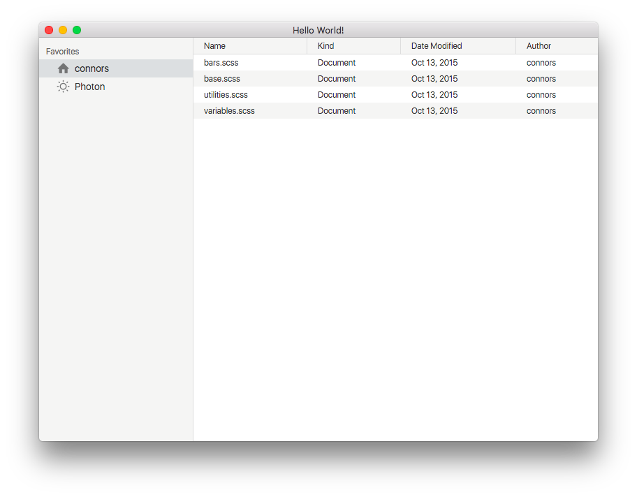

electron-test
==============



### setup ###

```bash
$ npm -g install electron
$ npm -g install electron-prebuilt
$ npm -g install electron-packager
```

### run ###

```bash
$ electron . 
```

### package ###

```
$ electron-packager ./ electron-test --platform=darwin,win32 --arch=x64 --version=0.36.1
```

### open packaged app (mac) ###

```
open ./electron-test-darwin-x64/electron-test.app
```

- packaged app for mac
  - ./electron-test-darwin-x64/electron-test.app
- packaged app for win
  - ./electron-test-win32-x64/electron-test.exe
  
